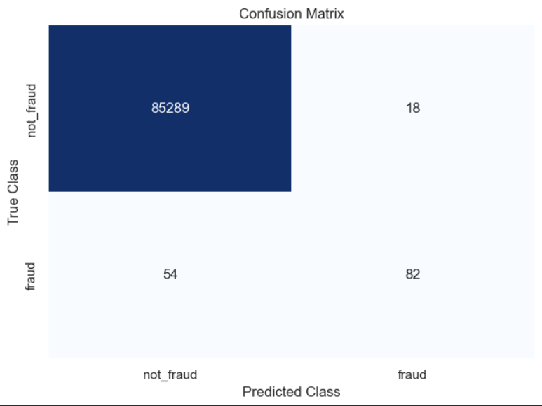

# Credit Card Fraud detection
A credit card fraud detection system using LogisticRegression

## How To Run it

### 1. Input the credit card data
- Download sample credit card data from "https://www.kaggle.com/code/renjithmadhavan/credit-card-fraud-detection-using-python/input"
- Save the credit card data in a file named 'creditcard.csv' in the active directory

### 2. Run the prediction model
- Run all of the Jupyter Lab cells in 'cc_fraud.ipynb'

### 3. Evaluate the model's performance
- Determine whether the returned Recall and F1 scores are adequate to rely on the model

